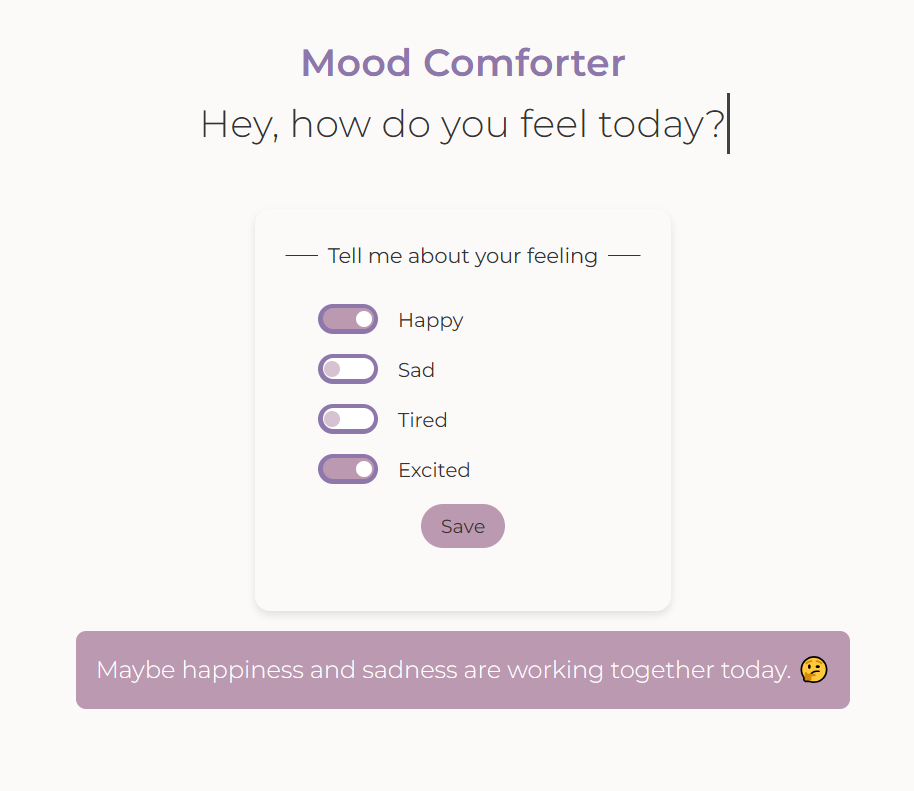

# 😌 Mood Comforter

> A simple and interactive mood tracker that provides comforting messages based on selected emotions. Built with **HTML**, **CSS**, and **JavaScript**.

## 📑 Table of Contents

- [General Info](#general-info)
- [Screenshots](#screenshots)
- [Technologies](#technologies)
- [Setup](#setup)
- [Code Examples](#code-examples)
- [Features](#features)
- [Project Status](#project-status)
- [Inspiration](#inspiration)
- [Contact](#contact)

---

## General Info

Mood Comforter is a simple web app that allows users to select their current mood(s) and receive a comforting message. It utilizes **JavaScript** for dynamic content updates and local storage to save user selections.

---

## Screenshots



---

## Technologies

- HTML5
- CSS3
- JavaScript (Vanilla)
- Node.js (v14.16.0)
- Visual Studio Code (IDE)

---

## Setup

1. Clone this repository:

   ```sh
   git clone https://github.com/boba-milktea/mood-comforter.git
   ```

2. Navigate to the project folder:

   ```sh
   cd mood-comforter
   ```

3. Open `index.html` in a browser.

## Code Examples

```js
const handleChange = (e) => {
  if (e.target.checked) {
    data.moodChecked.push(e.target.id);
  } else {
    data.moodChecked.splice(data.moodChecked.indexOf(e.target.id), 1);
  }
};
```

## Features

- Select multiple moods
- Get mood-based messages
- Save moods in local storage

## To-Do List

- Improve UI/UX
- Add more mood combinations
- Convert project to React

## Project Status

Project is: Done

## Inspiration

Inspired by another simple app - cat advice.

## Contact

By [boba-milktea](https://github.com/boba-milktea)
